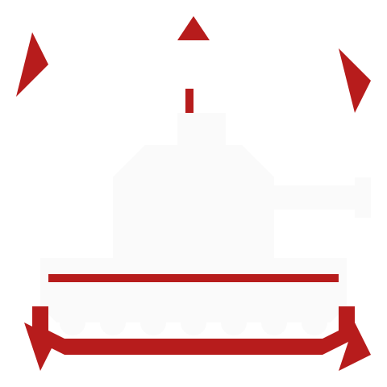

<p align="center"></p>

# Giga Tank Control Hub

> Panneau de télémétrie tactique militaire pour simulateurs de chars — **Arduino GIGA R1 WiFi** + **GIGA Display Shield** ou **Interface Web React**


---

## Description (V2 — read-only)

Ce projet transforme un **Arduino GIGA R1 WiFi** équipé de son **GIGA Display Shield** (écran tactile 800×480 px) en un cockpit de télémétrie passif, inspiré des MFD (Multi-Function Displays) embarqués des chars modernes.

Une **interface web React** (style MFD phosphore vert) est disponible en parallèle. Elle s'affiche dans un navigateur (écran secondaire, tablette) et lit les mêmes données via le bridge Python local.

### Changements V2

- **USB HID supprimé.** Les frappes clavier passaient 1 fois sur 2 dans War Thunder à cause de DirectInput/RawInput — le hub est désormais **passif en lecture seule**.
- **Splash screen** au démarrage (logo + barre de progression, 2,5 s).
- **Carte tactique** : icônes vectorielles (tank/avion/objectif/aérodrome/bomb point/respawn) avec orientation calculée depuis `ex`/`ey`, au lieu de simples points colorés.
- **Module Integrity dynamique** : santé des 6 modules (ENGINE / TRANSMISSION / TURRET / BARREL / TRACK L / TRACK R) reconstruite par parsing de `/hudmsg`, avec reset à chaque changement de carte.
- **Event Feed** live : kills, dégâts et alertes affichés en flux temps réel.
- **Performances** : conversion RGB565 vectorisée en NumPy (~50× plus rapide), élimination des `String` Arduino (zéro fragmentation heap), correction d'une race condition sur le tampon image, `delay(1)` au lieu de `delay(5)` dans la boucle principale.

### Trois écrans

1. **OVERVIEW** : vitals (DRIVER/GUNNER/CREW), warnings (FIRE/OVERSPEED/LWS/IRCM/AMMO/FUEL), drivetrain compact (vitesse/RPM/gear/fuel), event feed live.
2. **VEHICLE STATUS** : télémétrie détaillée + 6 barres de module integrity dynamiques.
3. **TACTICAL MAP** : carte plein écran avec fond depuis WT, anneaux radar, icônes vectorielles tournées selon l'orientation.

---

## Architecture

```
Giga-Tank-Control-Hub/
├── assets/
│   └── logo.svg                            # Logo source (rouge/blanc)
├── scripts/
│   ├── svg_to_rgb565.py                    # Génère splash_image.h depuis le SVG
│   └── encode_icons.py                     # Génère map_icons.h (8 icônes RGB565)
├── Control_Hub_War_Thunder/
│   ├── Control_Hub_War_Thunder.ino         # Sketch principal (LVGL + Serial)
│   ├── splash_image.h                      # Logo 280×280 PROGMEM (généré)
│   └── map_icons.h                         # 9 icônes 20×20 PROGMEM (généré)
├── pc_bridge/
│   ├── wt_telemetry.py                     # Bridge Arduino : WT API → Serial
│   └── wt_web_bridge.py                    # Bridge Web : WT API + HUDMSG → HTTP
├── Interface_Figma/                        # Interface web React
│   └── src/app/
│       ├── App.tsx, routes.ts, api.ts
│       └── components/
│           ├── Dashboard.tsx               # Écran 1 : overview
│           ├── VehicleStatus.tsx           # Écran 2 : status
│           ├── TacticalMap.tsx             # Écran 3 : map
│           ├── EventFeed.tsx               # Composant feed événements
│           └── MapIcon.tsx                 # Icône carte mémoisée
└── README.md
```

### Deux modes d'utilisation

| Mode | Matériel | Script Python | Description |
|---|---|---|---|
| **Arduino** | GIGA R1 + Display Shield | `wt_telemetry.py` | Interface LVGL 800×480 sur écran physique |
| **Web** | PC + navigateur | `wt_web_bridge.py` | Interface React (localhost:5173 ou `pc_bridge/static`) |

### Pourquoi mono-cœur ?

Le sketch tourne intégralement sur le M7. Une expérimentation antérieure (PR #13) avait tenté de déporter le parsing sur le M4 via RPC : la latence inter-cœur (~5-10 ms par requête) dépassait le gain local. Le M4 reste donc disponible pour de futures charges (touch pre-processing, watchdog dédié) mais n'est pas utilisé pour l'instant.

### Architecture Web

```
War Thunder (127.0.0.1:8111)
    │  HTTP polling (10 Hz)
    ▼
  wt_web_bridge.py (localhost:8112) — lecture seule
    │  HTTP + CORS
    ▼
  Interface React (localhost:5173)
    ├─ GET /api/telemetry        → instruments
    ├─ GET /api/map + map/image  → carte tactique
    ├─ GET /api/modules          → module health 0-100
    └─ GET /api/events           → flux HUD (kills, damage, alerts)
```

---

## Interface Web (React)

### Prérequis

```bash
# Bridge Python
pip install flask flask-cors requests pyserial Pillow numpy

# Interface React (depuis Interface_Figma/)
npm install
```

### Lancement

1. **Démarrer le bridge web :**
   ```bash
   python pc_bridge/wt_web_bridge.py
   ```
   Sert sur `http://localhost:8112`.

2. **Démarrer l'interface React :**
   ```bash
   cd Interface_Figma
   npm run dev
   ```
   Ouvrez `http://localhost:5173`.

3. **Lancer War Thunder** et entrer dans une partie avec un char.

### Build production

```bash
cd Interface_Figma
npm run build
```
La build est écrite dans `pc_bridge/static/`. Le bridge Flask sert alors directement l'app sur `http://localhost:8112`.

---

## Interface Arduino LVGL

| Composant | Référence | Description |
|---|---|---|
| Carte | Arduino GIGA R1 WiFi (ABX00063) | STM32H747XI dual-core, USB-C |
| Écran | Arduino GIGA Display Shield (ASX00039) | 3.97", 800×480, tactile capacitif |
| Câble | USB-C vers USB-A | Connexion PC ↔ Arduino |

### Bibliothèques Arduino

1. Installez **Arduino IDE 2.x**.
2. Gestionnaire de cartes : `Arduino Mbed OS Giga Boards`.
3. Gestionnaire de bibliothèques :
   - `Arduino_H7_Video`
   - `Arduino_GigaDisplayTouch`
   - `lvgl` (**9.5 ou supérieur**)

Le sketch tourne sur un seul cœur (M7). Laissez la configuration Flash Split par défaut.

### Génération des assets

Avant la première compilation (ou après avoir modifié `assets/logo.svg`) :

```bash
pip install Pillow numpy
python3 scripts/svg_to_rgb565.py
python3 scripts/encode_icons.py
```

Cela produit `Control_Hub_War_Thunder/splash_image.h` et `map_icons.h` (déjà commités, mais à régénérer si le logo change).

### Upload du sketch

1. **Tools → Target Core → Main Core**.
2. Ouvrez `Control_Hub_War_Thunder/Control_Hub_War_Thunder.ino`.
3. Sélectionnez la carte **Arduino GIGA R1 WiFi** et le bon port COM.
4. Flashez.

### Bridge télémétrique

```bash
pip install requests pyserial Pillow numpy
python pc_bridge/wt_telemetry.py
```

---

## API War Thunder — Documentation (localhost:8111)

War Thunder expose ses données télémétriques sur `http://127.0.0.1:8111` automatiquement dès qu'une partie est lancée. Ce serveur local s'arrête à la fin de la session.

> Gaijin Entertainment ne garantit pas la stabilité de cette API entre les mises à jour. Les noms de clés peuvent changer selon la version du client ou le type de véhicule.

### Endpoints utilisés

| Endpoint | Format | Description |
|---|---|---|
| `/indicators` | JSON | Instruments en temps réel |
| `/state` | JSON | État général de la session |
| `/map_info.json` | JSON | Métadonnées de la carte (incluant `map_generation`) |
| `/map_obj.json` | JSON | Objets sur la carte (véhicules, objectifs) |
| `/map.img` | JPEG | Image bitmap de la carte (1024×1024) |
| `/hudmsg` | JSON | Messages HUD (dégâts, kills, alertes) |

### Clés `/indicators` consommées

`speed`, `rpm`, `gear`, `first_stage_ammo`, `crew_current`, `crew_total`, `stabilizer`, `fuel`, `type`, `army`, `engine_on_fire`, `driver_state`, `gunner_state`, `has_speed_warning`, `lws`, `ircm`.

### Clés `/map_obj.json` consommées

`type`, `color`, `blink`, `x`, `y`, `ex`, `ey` (utilisées pour la rotation des véhicules via `atan2(ey-y, ex-x)`).

### Clés `/hudmsg` consommées

- `events[].msg` → `EVT:K:` (kill) ou `EVT:A:` (alert).
- `damage[].msg` → `EVT:D:` (damage) et décrément du `module_health` correspondant via les mots-clés `engine`, `transmission`, `track`, `barrel`, `turret`. Décrément `-35` pour `destroyed/broken`, `-15` pour `damaged/jammed/hit`.

---

## Protocole Serial (Arduino ↔ Python)

Le script Python envoie 4 types de lignes texte sur le port série, toutes terminées par `\n`.

### Télémétrie (10 Hz)

```
SPD:42|RPM:2100|GEAR:4.0|AMMO:18|STAB:1|FUEL:78|CREW:4/4|TANK:US_M1A2_ABRAMS|
  DRV:0|GUN:0|FIRE:0|OVER:0|LWS:-1|IRCM:-1|STATUS:1
```

### Carte tactique (5 Hz)

```
MAPNAME:MAP42|MAPOBJ:0.52,0.48,T,0;0.30,0.65,t,90;0.70,0.20,O,0
```

| Code | Entité | Couleur |
|------|--------|---------|
| `T` | Tank allié | Vert |
| `t` | Tank ennemi | Rouge |
| `P` | Aircraft allié | Vert |
| `p` | Aircraft ennemi | Rouge |
| `O` | Objectif / zone de capture | Jaune |
| `F` | Aérodrome | Bleu |
| `B` | Bomb point | Rouge |
| `R` | Respawn base | Bleu |
| `N` | Autre | Gris |

Le quatrième champ optionnel est l'orientation (degrés entiers, 0-359). Pour rétro-compatibilité, le parser Arduino accepte aussi le format ancien à 3 champs.

### Module integrity (1 Hz)

```
MOD:ENG:100|TRANS:80|TURR:100|GUN:90|TRKL:60|TRKR:100
```

### Event feed (au fil de l'eau)

```
EVT:K:Player has destroyed an enemy
EVT:D:Engine damaged
EVT:A:Returning to battle area
```

Préfixes : `K` = kill, `D` = damage, `A` = alert.

### Carte image (1× par `map_generation`)

```
MAPRAW:<base64-RGB565-little-endian>
```

Le payload base64 décode en exactement 19 240 octets (148 × 65 × 2). Côté Arduino, le décodage se fait dans un tampon temporaire puis est copié sous mutex dans le tampon affiché par LVGL, évitant tout tearing visuel.

---

## Boîtier 3D recommandé

Pour un usage bureau optimal, modélisez (Fusion 360, FreeCAD) un boîtier incliné à **30-45 degrés** en **PLA ou PETG** avec :
- Standoffs M3 internes pour fixer la carte
- Encoche USB-C sur la tranche
- Fentes d'aération style grille de blindage
- Texture "Fuzzy Skin" dans le slicer pour un rendu métallique

---

## Licence

MIT — libre d'utilisation, de modification et de distribution.
